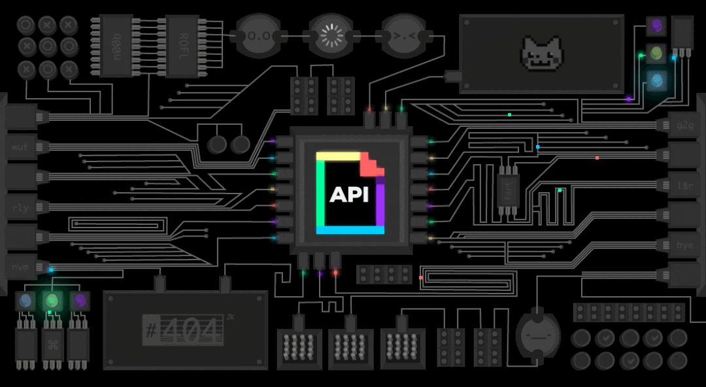

<!-- Social + stats badges -->

 

# Hi there 👋, I'm **Karun Rayamajhi**

---

---

## 👨‍💻 About Me

Frontend Engineer with **1.5+ years** of experience shipping production web & mobile apps in **React, Next.js, TypeScript, and React Native**. I own frontend architecture, feature-based module boundaries, and server-state modeling with **TanStack Query**.

Backed by practical DevOps (**Docker, Nginx, GitHub Actions, Cloudflare DNS, Linux VPS**) and clean integration with third-party & existing backends (REST APIs, PocketBase, Appwrite). I use **AI-assisted development** (Claude API, Claude Code) as a daily engineering tool.

- 🔭 Currently building a **drag-and-drop Form Builder** for a school ERP admin panel
- 🏆 **1st Place** at the Company Hackathon, Chautari Digital (Nov 2025)
- 🌱 Sharpening **Testing (Vitest, Playwright, RTL)**, **Accessibility (WCAG)** & **Core Web Vitals**
- 📍 Kathmandu, Nepal

| | |
|:---:|:---:|
| **Email** | [rayamajhikarun@gmail.com](mailto:rayamajhikarun@gmail.com) |
| **Phone** | [+977 9864476794](tel:+9779864476794) |
| **Location** | Lalitpur, Lubhu, Kathmandu |

---

## 🛠️ Tech Stack

### Languages

<table>
  <tr>
    <td align="center"> <b>HTML</b></td>
    <td align="center"> <b>CSS</b></td>
    <td align="center"> <b>JavaScript</b></td>
    <td align="center"> <b>TypeScript</b></td>
    <td align="center"> <b>Python</b></td>
    <td align="center"> <b>Bash</b></td>
  </tr>
</table>

### Frontend

<table>
  <tr>
    <td align="center"> <b>React</b></td>
    <td align="center"> <b>Next.js</b></td>
    <td align="center"> <b>Tailwind</b></td>
    <td align="center"> <b>Redux</b></td>
  </tr>
</table>

### Backend & Databases

<table>
  <tr>
    <td align="center"> <b>PostgreSQL</b></td>
    <td align="center"> <b>Appwrite</b></td>
    <td align="center"> <b>Supabase</b></td>
    <td align="center"> <b>Redis</b></td>
    <td align="center"> <b>SQLite</b></td>
  </tr>
</table>

### DevOps & Infrastructure

<table>
  <tr>
    <td align="center"> <b>Docker</b></td>
    <td align="center"> <b>Nginx</b></td>
    <td align="center"> <b>Actions</b></td>
    <td align="center"> <b>Cloudflare</b></td>
    <td align="center"> <b>Linux</b></td>
    <td align="center"> <b>Ubuntu</b></td>
    <td align="center"> <b>Vercel</b></td>
  </tr>
</table>

### Tools

<table>
  <tr>
    <td align="center"> <b>Git</b></td>
    <td align="center"> <b>GitHub</b></td>
    <td align="center"> <b>VS Code</b></td>
    <td align="center"> <b>Figma</b></td>
    <td align="center"> <b>Postman</b></td>
    <td align="center"> <b>npm</b></td>
    <td align="center"> <b>pnpm</b></td>
  </tr>
</table>

### Libraries & Frameworks I Work With

- **State & Data:** `Zustand` `Redux Toolkit` `TanStack Query` `TanStack Table`
- **Forms & Validation:** `React Hook Form` `Zod`
- **UI & Styling:** `shadcn/ui` `NativeWind` `Framer Motion` `GSAP`
- **Mobile:** `React Native` `Expo` `Expo Router` `Expo Camera` `Face Detector` `react-native-gifted-chat` `EAS Build` `Push Notifications` `i18n`
- **Drag & Drop, Rich Text, Charts:** `dnd-kit` `TipTap` `Recharts`
- **Auth, Payments & Backend:** `Clerk` `Stripe` `Plaid` `Dwolla` `PocketBase` `Firebase` `REST APIs`
- **Testing & Tooling:** `Vitest` `Playwright` `React Testing Library` `Storybook` `Biome` `Husky` `Turbopack`
- **AI & Automation:** `Claude API` `Claude Code` `MCP`

---

## 📊 GitHub Stats

---

## 🌟 Enjoying My Projects?

If you find my work helpful, consider **starring my repositories** or **following me**. It really motivates me to keep building and learning. 😊

